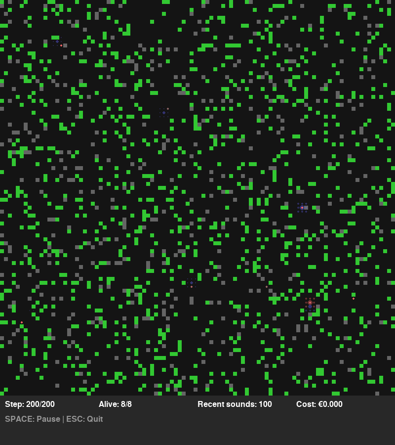

# Tiny Entities

🧬 Artificial life simulation with emergent mood-based cognition and social behaviors.



**Status**: ✅ **Functional** - Simulations run successfully with graphical visualization

## Features

- 🎭 **Emergent Mood System** - Creatures develop emotional states from reward prediction errors
- 🗺️ **2D Grid World** - Dynamic environment with food, obstacles, and sound propagation  
- 🎨 **Real-time Visualization** - pygame-based rendering with mood-colored creatures
- 🔊 **Sound Communication** - Creatures emit and respond to sounds
- 📊 **Analysis Tools** - Track emergence patterns and collective behaviors
- 🧪 **Headless Mode** - Generate snapshots without display for testing/docs

## Quick Start

### Setup

```bash
# Using pip
pip install -e ".[dev]"
cp .env.example .env

# Or using uv (recommended - faster and more reliable)
uv sync --all-extras  # Use --all-extras to include dev dependencies
cp .env.example .env
```

### Quick Demo

Run the comprehensive demo to see all features:
```bash
# With uv (recommended)
uv run python demo.py

# Or if you used pip
python demo.py
```

This demonstrates console mode, visualization, and analysis tools in one go.

### Run

Basic simulation (console output):
```bash
# With uv (recommended)
uv run python examples/basic_simulation.py --creatures 8 --steps 5000

# Or if you used pip
python examples/basic_simulation.py --creatures 8 --steps 5000
```

With visualization (requires display):
```bash
# With uv (recommended)
uv run python examples/basic_simulation.py --visualize --creatures 8

# Or if you used pip
python examples/basic_simulation.py --visualize --creatures 8
```

Headless mode (generates PNG snapshots):
```bash
# With uv (recommended)
uv run python examples/headless_visualization.py --creatures 10 --steps 1000

# Or if you used pip
python examples/headless_visualization.py --creatures 10 --steps 1000
```

See [QUICKSTART.md](QUICKSTART.md) for more details and [ROADMAP.md](ROADMAP.md) for development plans.
