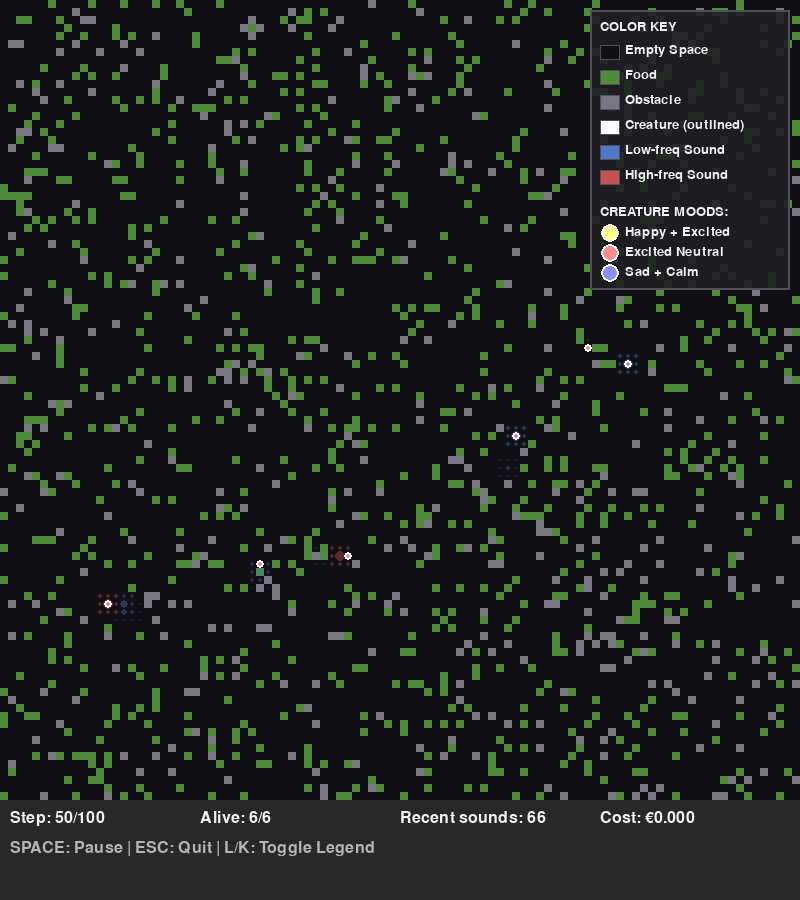

# Tiny Entities

🧬 Artificial life simulation with emergent mood-based cognition and social behaviors.



**Status**: ✅ **Functional** - Simulations run successfully with graphical visualization

## Features

- 🎭 **Emergent Mood System** - Creatures develop emotional states from reward prediction errors
- 🧠 **LLM-assisted Cognition** - Optional OpenRouter integration with free tier models for action selection, self-reflection journals, and emergence analysis
- 💰 **Built-in Cost Tracking** - Automatic pricing calculations and daily spending limits protect your budget
- 🗺️ **2D Grid World** - Dynamic environment with food, obstacles, and sound propagation
- 🎨 **Real-time Visualization** - pygame-based rendering with mood-colored creatures
- 🔊 **Procedural Sound Synthesis** - Every vocalization generates a mood-infused audio waveform for analysis or export
- 📊 **Analysis Tools** - Track emergence patterns and collective behaviors, including AI-written summaries when LLMs are enabled
- 🧪 **Headless Mode** - Generate snapshots without display for testing/docs
- ⚙️ **YAML Configuration** - Easy experiment setup with validated configuration files (NEW!)
- 🛡️ **Robust Error Handling** - Graceful fallbacks and comprehensive logging for reliability (NEW!)
- 📝 **Professional Logging** - Configurable logging with performance metrics tracking (NEW!)

## Recent Improvements (Phase 1) 🎉

**November 2025**: Major reliability and usability improvements implemented:
- ✅ Comprehensive error handling for API calls and invalid data
- ✅ YAML-based configuration system with validation
- ✅ Professional logging with performance metrics
- ✅ Four ready-to-use configuration presets (default, small, large, social)

See [docs/PHASE1_PROGRESS.md](docs/PHASE1_PROGRESS.md) for details.

## Quick Start

### Setup

```bash
# Using pip
pip install -e ".[dev]"
cp .env.example .env

# Or using uv (recommended - faster and more reliable)
uv sync --all-extras  # Use --all-extras to include dev dependencies
cp .env.example .env
```

### API Configuration (Optional)

The simulation can use LLM models for more sophisticated creature behaviors and emergence analysis.

#### Why OpenRouter?

We recommend **OpenRouter** as the default API provider because it offers:
- **Single API key** for accessing multiple model providers (Anthropic, Meta, OpenAI, etc.)
- **Free tier models** like Llama 3.1 8B for cost-free experimentation
- **Latest models** including Claude 3.5 Sonnet, the most capable Claude model
- **Transparent pricing** with automatic cost tracking in EUR
- **Automatic fallbacks** and intelligent routing

#### Default Models

- **Action Model**: `meta-llama/llama-3.1-8b-instruct:free` - Free tier model for creature decision-making
- **Analysis Model**: `anthropic/claude-3.5-sonnet` - Premium model for sophisticated emergence analysis

#### Setup

1. Get your free API key at [OpenRouter](https://openrouter.ai/)
2. Add it to your `.env` file:
```bash
OPENROUTER_API_KEY=your_openrouter_key_here
```

The free tier Llama model means you can run simulations with LLM features at **zero cost**!

#### Customization

You can customize models and set spending limits in `.env`:
```bash
DEFAULT_FREE_MODEL=meta-llama/llama-3.1-8b-instruct:free
DEFAULT_ANALYSIS_MODEL=anthropic/claude-3.5-sonnet
MAX_DAILY_COST_EUR=2.0  # Built-in cost protection
```

The system includes automatic cost tracking - see `src/config/model_pricing.py` for pricing data on 13+ popular models.

### Quick Demo

Run the comprehensive demo to see all features:
```bash
# With uv (recommended)
uv run python demo.py

# Or if you used pip
python demo.py
```

This demonstrates console mode, visualization, and analysis tools in one go. When LLM credentials are present the demo will also showcase reflective journaling and AI-generated emergence summaries.

### Run

Basic simulation (console output):
```bash
# With uv (recommended)
uv run python examples/basic_simulation.py --creatures 8 --steps 5000

# Or if you used pip
python examples/basic_simulation.py --creatures 8 --steps 5000

# Use a configuration preset (NEW!)
uv run python examples/basic_simulation.py --config config/small.yaml
```

With visualization (requires display):
```bash
# With uv (recommended)
uv run python examples/basic_simulation.py --visualize --creatures 8

# Or if you used pip
python examples/basic_simulation.py --visualize --creatures 8

# Quick test with small configuration (NEW!)
uv run python examples/basic_simulation.py --visualize --config config/small.yaml
```

Headless mode (generates PNG snapshots):
```bash
# With uv (recommended)
uv run python examples/headless_visualization.py --creatures 10 --steps 1000

# Or if you used pip
python examples/headless_visualization.py --creatures 10 --steps 1000
```

### Using Configurations (NEW!)

Create custom experiments with YAML configs:
```bash
# Copy and modify an example
cp config/default.yaml config/my_experiment.yaml
# Edit config/my_experiment.yaml with your parameters

# Run with your configuration
uv run python examples/basic_simulation.py --config config/my_experiment.yaml
```

Available presets:
- `config/default.yaml` - Standard balanced configuration
- `config/small.yaml` - Quick testing (50x50, 5 creatures)
- `config/large.yaml` - Large-scale experiments (200x200, 50 creatures)
- `config/experiment_social.yaml` - Optimized for social behavior research

See [config/README.md](config/README.md) for configuration documentation.

## Running Tests

Ensure the development dependencies (including scientific libraries such as `numpy`) are installed before executing the test
suite:

```bash
uv sync --all-extras
uv run pytest
```

`uv sync` provisions the shared virtual environment, so `uv run` will automatically reuse the resolved packages when executing
`pytest`.

## Repository Layout

- `src/` – Primary simulation engine and modules
  - `tiny_entities/` – Package namespace
  - `simulation/` – Main loop, LLM-assisted analysis hooks, orchestration utilities
  - `creatures/` – Cognitive systems, mood regulation, and action policies
  - `world/` – Environment models, physics, and procedural audio synthesizer
  - `config/` – Configuration system, logging, and API clients
- `config/` – YAML configuration files (NEW!)
- `examples/` – Runnable demonstrations and legacy prototypes
- `docs/` – Extended documentation and implementation progress
- `tests/` – Automated unit tests

### Documentation

- [QUICKSTART.md](QUICKSTART.md) - Getting started guide
- [ROADMAP.md](ROADMAP.md) - Development plans
- [docs/IMPLEMENTATION_ROADMAP.md](docs/IMPLEMENTATION_ROADMAP.md) - Detailed implementation plan
- [docs/PHASE1_PROGRESS.md](docs/PHASE1_PROGRESS.md) - Current implementation progress (NEW!)
- [config/README.md](config/README.md) - Configuration system guide (NEW!)
