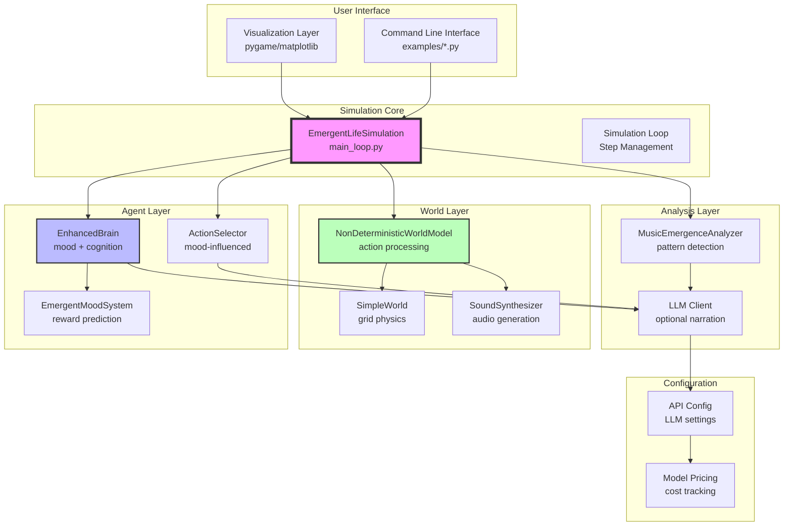
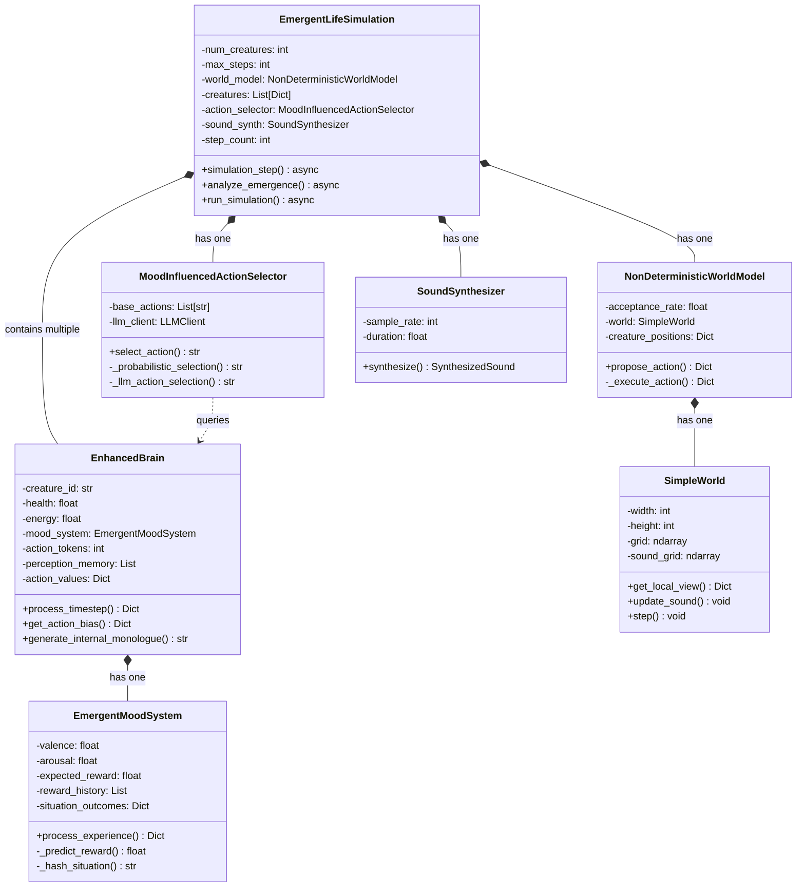
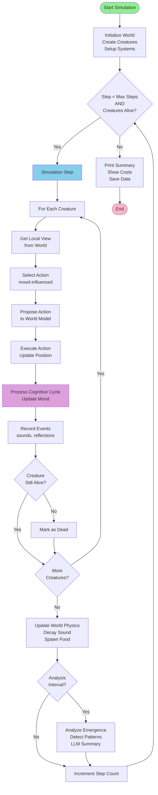
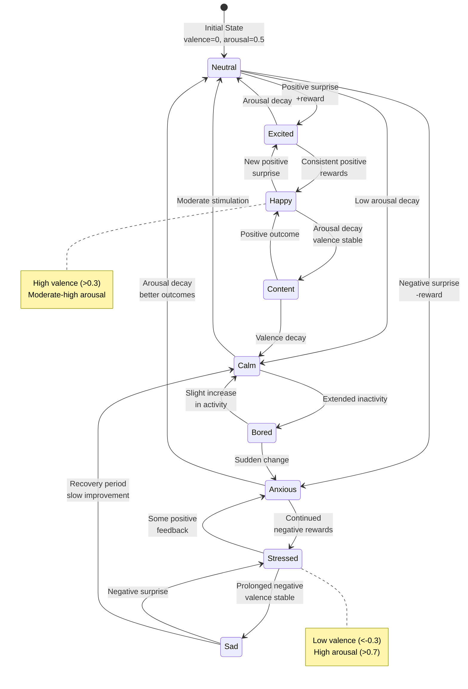
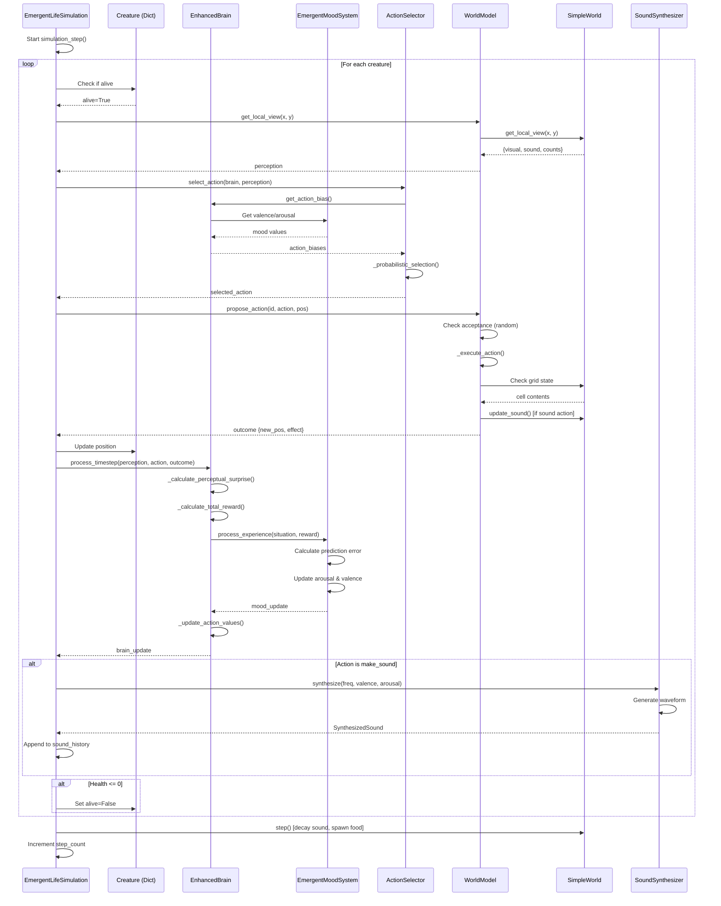
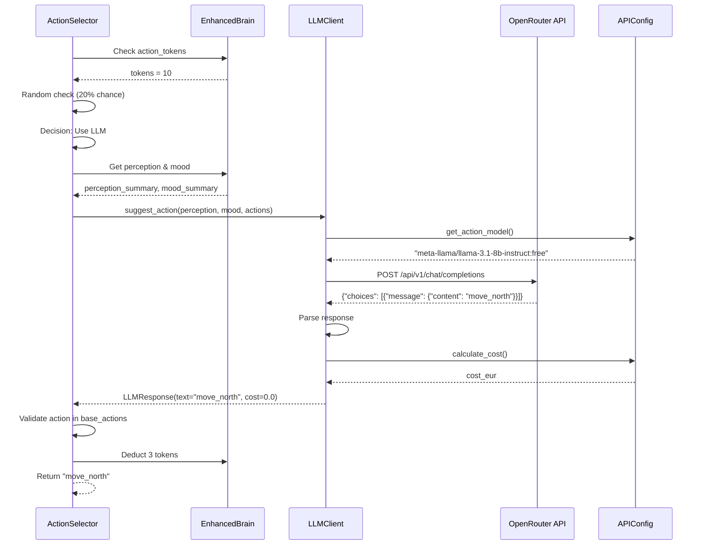
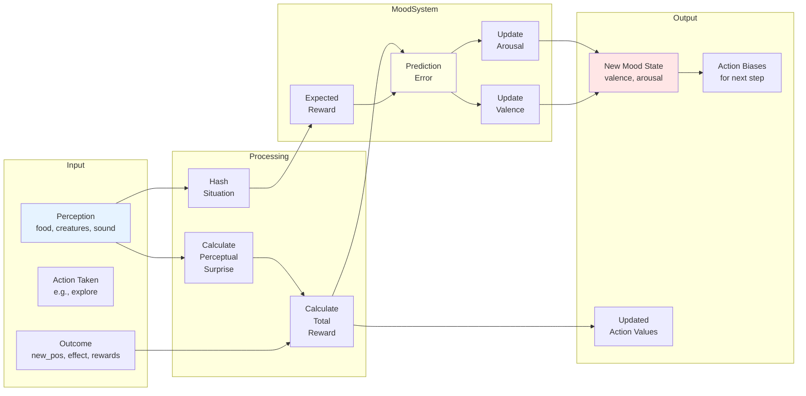

# Comprehensive Project Report: Tiny Entities

## Executive Summary

**Tiny Entities** is an artificial life simulation framework that implements emergent mood-based cognition and social behaviors in autonomous agents (creatures). The system demonstrates how simple reward prediction mechanisms can give rise to complex emotional states and social dynamics.

**Project Status**: ✅ Functional - Successfully runs simulations with graphical visualization

**Key Features**:
- Emergent mood system based on reward prediction errors
- LLM-assisted cognition (optional)
- 2D grid world with resources and sound propagation
- Real-time visualization with mood-colored creatures
- Procedural sound synthesis
- Analysis tools for emergence patterns

**Codebase Statistics**:
- Total lines of code: ~1,884 lines (Python)
- Core modules: 6 (creatures, world, simulation, config, emergence)
- Test coverage: Good (unit tests for core systems)
- Dependencies: NumPy, Matplotlib, Pygame, OpenAI/Anthropic APIs (optional)

---

## Table of Contents

1. [Architecture Overview](#architecture-overview)
2. [Class Structure and Relationships](#class-structure-and-relationships)
3. [Simulation Flow Diagrams](#simulation-flow-diagrams)
4. [Instance Interaction During Simulation](#instance-interaction-during-simulation)
5. [Component Deep Dive](#component-deep-dive)
6. [Areas Requiring Changes](#areas-requiring-changes)
7. [Technical Debt and Improvements](#technical-debt-and-improvements)
8. [Recommendations](#recommendations)

---

## 1. Architecture Overview

The Tiny Entities system follows a modular architecture with clear separation of concerns:



### Key Design Patterns

1. **Component-Based Architecture**: Clear separation between simulation, agents, world, and analysis
2. **Observer Pattern**: Simulation loop observes and records creature behaviors
3. **Strategy Pattern**: Different action selection strategies (rule-based vs LLM-based)
4. **Factory Pattern**: Creature creation in simulation initialization
5. **Facade Pattern**: NonDeterministicWorldModel provides simplified world interaction

---

## 2. Class Structure and Relationships

### 2.1 Core Classes Diagram



### 2.2 Class Responsibilities

| Class | Primary Responsibility | Key Methods |
|-------|----------------------|-------------|
| `EmergentLifeSimulation` | Main simulation orchestration | `simulation_step()`, `analyze_emergence()` |
| `EnhancedBrain` | Creature cognition and mood | `process_timestep()`, `get_action_bias()` |
| `EmergentMoodSystem` | Mood state from reward prediction | `process_experience()`, `_predict_reward()` |
| `MoodInfluencedActionSelector` | Action selection based on mood | `select_action()` |
| `NonDeterministicWorldModel` | World interaction and physics | `propose_action()`, `_execute_action()` |
| `SimpleWorld` | Grid-based world state | `get_local_view()`, `step()` |
| `SoundSynthesizer` | Audio waveform generation | `synthesize()` |
| `MusicEmergenceAnalyzer` | Pattern detection in sounds | `analyze_collective_music()` |


---

## 3. Simulation Flow Diagrams

### 3.1 High-Level Simulation Loop



### 3.2 Creature Cognitive Cycle

```mermaid
flowchart LR
    subgraph "Perception Phase"
        P1[Receive World View] --> P2[Extract Features<br/>food, creatures, sound]
        P2 --> P3[Calculate Perceptual<br/>Surprise]
    end
    
    subgraph "Action Selection"
        A1[Get Mood Biases<br/>from valence/arousal] --> A2[Add Situational<br/>Modifiers]
        A2 --> A3{Use LLM?}
        A3 -->|Yes| A4[LLM Action<br/>Suggestion]
        A3 -->|No| A5[Probabilistic<br/>Selection]
        A4 --> A6[Selected Action]
        A5 --> A6
    end
    
    subgraph "World Interaction"
        W1[Propose Action] --> W2{World<br/>Accepts?}
        W2 -->|Yes| W3[Execute Action<br/>Update Position]
        W2 -->|No| W4[Action Blocked]
        W3 --> W5[Get Outcome]
        W4 --> W5
    end
    
    subgraph "Learning & Mood Update"
        L1[Calculate Total Reward<br/>surprise + outcome] --> L2[Compute Prediction Error<br/>reward - expected]
        L2 --> L3[Update Arousal<br/>based on |error|]
        L3 --> L4[Update Valence<br/>based on sign of error]
        L4 --> L5[Update Action Values]
        L5 --> L6[Update Expected Reward<br/>for situation]
    end
    
    subgraph "State Update"
        S1[Update Health/Energy] --> S2[Check Survival]
        S2 --> S3{Health <= 0?}
        S3 -->|Yes| S4[Die]
        S3 -->|No| S5[Continue]
    end
    
    P3 --> A1
    A6 --> W1
    W5 --> L1
    L6 --> S1
    
    style P1 fill:#E6F3FF
    style A6 fill:#FFE6E6
    style W3 fill:#E6FFE6
    style L4 fill:#FFFFE6
    style S4 fill:#FFB6C1
```

### 3.3 Mood System State Transitions




---

## 4. Instance Interaction During Simulation

### 4.1 Sequence Diagram: Single Simulation Step



### 4.2 Object Interaction: Action Selection with LLM



### 4.3 Data Flow: Mood Update Process




---

## 5. Component Deep Dive

### 5.1 Creature Brain System

**File**: `src/creatures/brain.py` (307 lines)

The `EnhancedBrain` class is the cognitive core of each creature:

**Key Attributes**:
- `health`, `energy`: Survival metrics (0-100)
- `mood_system`: EmergentMoodSystem instance
- `action_tokens`: Currency for expensive actions (LLM calls)
- `perception_memory`: Last 20 perceptions for surprise calculation
- `action_values`: Learned expected value of each action

**Cognitive Cycle** (process_timestep):
1. **Perception Processing**: Compare current perception to memory
2. **Surprise Calculation**: Measure novelty (changes in food, creatures, sound)
3. **Reward Calculation**: Combine surprise (0.5x) with survival outcomes
4. **Mood Update**: Process through EmergentMoodSystem
5. **Learning**: Update action values using exponential moving average (α=0.1)
6. **Token Management**: Gain tokens from surprise, spend on LLM calls

**Mood Influence on Behavior**:
```python
# High arousal → exploration and loud sounds
if arousal > 0.7:
    biases["explore"] = 0.3
    biases["make_sound_high"] = 0.2

# Low arousal → conservation
if arousal < 0.3:
    biases["stay"] = 0.3
    biases["listen"] = 0.2

# Positive valence → social behaviors  
if valence > 0.3:
    biases["make_sound_low"] = 0.2

# Negative valence → avoidance
if valence < -0.3:
    biases["move_south"] = 0.2
    biases["stay"] = 0.1
```

**Internal Monologue**:
- Rule-based: Combines mood words, need words, and perception words
- LLM-based (optional): Generates natural language reflections based on context

### 5.2 Emergent Mood System

**File**: `src/creatures/mood_system.py` (86 lines)

Implements mood as emergent from **reward prediction errors** (inspired by reinforcement learning):

**Core Theory**:
- **Valence** (happiness/sadness, -1 to 1): Emerges from *signed* prediction errors
  - Better than expected → increases valence
  - Worse than expected → decreases valence
  - Changes slowly (α=0.01) for stability
  
- **Arousal** (intensity/activation, 0 to 1): Emerges from *absolute* prediction errors
  - Big surprises (good or bad) → increases arousal
  - Changes quickly (α=0.1) for responsiveness
  - Naturally decays over time (0.99x per step)

**Learning Mechanism**:
```python
prediction_error = actual_reward - expected_reward

# Fast arousal response to surprise magnitude
arousal_change = abs(prediction_error) * 0.1
arousal = min(1.0, arousal + arousal_change)

# Slow valence adaptation to outcome direction
valence_change = prediction_error * 0.01
valence = clip(valence + valence_change, -1.0, 1.0)
```

**Situation Memory**:
- Hashes situations into keys: "food_True_creatures_2_sound_high"
- Stores last 10 outcomes for each situation
- Predicts reward as mean of past outcomes in similar situations
- Falls back to baseline (0.0) for novel situations

**Emergent Moods**:
- **Happy**: High valence (>0.3), moderate arousal
- **Excited**: High valence, high arousal (>0.7)
- **Sad**: Low valence (<-0.3), moderate arousal
- **Stressed**: Low valence, high arousal
- **Calm**: Moderate valence, low arousal (<0.3)

### 5.3 World Physics

**File**: `src/world/physics.py` (83 lines)

Simple Conway-inspired 2D grid world (default 100x100):

**Grid States**:
- 0 = Empty space
- 1 = Food resource
- 2 = Obstacle (blocks movement)
- 3 = Creature (not currently used directly)

**Sound Propagation**:
- Separate layer: `sound_grid[y, x] = [frequency, amplitude]`
- When creature makes sound, sets cell to [freq, amp]
- Propagates to 8 neighbors at 50% strength
- Only propagates if new sound is louder than existing
- Decays by 10% per timestep (multiply by 0.9)

**Resource Dynamics**:
- Initial spawn: 10% food density, 5% obstacle density
- Periodic respawn: 1% chance per step to spawn 0.5% more food
- Food consumed by creatures is removed from grid
- No obstacle removal or creation after init

**Local Perception**:
- Creatures see 11x11 grid (radius=5) centered on position
- Edge handling: Clamps to world boundaries
- Returns: visual grid, sound grid, counts of each cell type

### 5.4 Action Selection

**File**: `src/creatures/action_selection.py` (128 lines)

**Available Actions** (10 total):
```python
["move_north", "move_south", "move_east", "move_west",
 "stay", "eat", "make_sound_low", "make_sound_high", 
 "listen", "explore"]
```

**Selection Strategy**:
1. **Get Mood Biases**: Query brain's `get_action_bias()` 
   - Returns dict of action → bias value (0.0 to 0.3+)
   
2. **Add Situational Modifiers**:
   - Food nearby + low health → bias "eat" to 0.8
   - Low energy (<20) → bias "stay" to 0.7
   
3. **LLM Consultation** (optional, 20% chance if tokens available):
   - Summarize perception and mood as JSON
   - Call LLM with available actions
   - Parse response and validate
   - Deduct 3 tokens on success
   
4. **Probabilistic Selection**:
   - Convert biases to probabilities
   - Base probability: 1/10 = 0.1 for each action
   - Add bias to base probability
   - Normalize to sum to 1.0
   - Sample action using np.random.choice

**LLM Integration**:
- Default model: "meta-llama/llama-3.1-8b-instruct:free"
- Free tier → no cost for action selection
- Provides more contextually appropriate actions
- Falls back to probabilistic if LLM fails

### 5.5 Sound Synthesis

**File**: `src/world/sound_engine.py` (60 lines)

Procedural audio generation influenced by creature mood:

**Synthesis Algorithm**:
```python
# Base frequency from action
base_frequency = 220 + frequency_hint * 660  # 220-880 Hz

# Amplitude from arousal (higher arousal → louder)
amplitude = 0.4 + abs(mood_arousal) * 0.6  # 0.4-1.0

# Vibrato from valence (pitch modulation)
vibrato = 1 + mood_valence * 0.05 * sin(2π * 5Hz * t)

# Carrier wave with vibrato
carrier = sin(2π * base_freq * vibrato * t)

# Add harmonic richness
harmonic = 0.3 * sin(2π * base_freq * 2 * t)

# Combine and apply envelope
waveform = amplitude * (carrier + harmonic) * envelope
```

**Parameters**:
- Sample rate: 22050 Hz (CD quality / 2)
- Duration: 0.35 seconds (short bursts)
- Envelope: Linear decay from 1.0 to 0.2 (percussive)
- Output: float32 NumPy array, clipped to [-1.0, 1.0]

**Mood Effects**:
- High arousal → louder sounds
- Positive valence → rising pitch modulation
- Negative valence → falling pitch modulation
- Harmonic added for richness

**Metadata Included**:
- base_frequency
- amplitude
- valence
- arousal

### 5.6 Emergence Analysis

**File**: `src/emergence/music_analyzer.py` (99 lines)

Detects patterns in collective sound behaviors:

**Metrics**:
1. **Music Score**: Simple count-based (min(10, events/10))
2. **Coordination**: Detects creatures responding to each other
3. **Entropy Trend**: Measures diversity changes over time

**Coordination Detection**:
```python
# Two sounds within 3 steps from different creatures
for i in range(1, len(sound_history)):
    if sound_history[i]['step'] - sound_history[i-1]['step'] <= 3:
        if sound_history[i]['creature_id'] != sound_history[i-1]['creature_id']:
            response_count += 1

coordination_detected = response_count > len(sounds) * 0.2
```

**Entropy Calculation**:
- Bins frequencies into 10 buckets
- Calculates Shannon entropy: -Σ(p * log2(p))
- Compares first quarter vs last quarter
- Trends: decreasing (<0.8x), stable, increasing (>1.2x)

**LLM Enhancement** (optional):
- Sends metrics and reflections to analysis model
- Default: "anthropic/claude-3.5-sonnet"
- Generates natural language interpretations
- Identifies emergent patterns in behaviors


---

## 6. Areas Requiring Changes

Based on the codebase analysis, here are the areas that need improvement:

### 6.1 Critical Issues

#### 1. **Lack of Type Hints** ⚠️
- **Current State**: Most functions lack type annotations
- **Impact**: Reduces code maintainability, IDE support, and error detection
- **Recommendation**: Add comprehensive type hints
- **Priority**: Medium
- **Example**:
```python
# Current
def select_action(self, brain, perception):
    return action

# Recommended  
def select_action(
    self, 
    brain: EnhancedBrain, 
    perception: Dict[str, Any]
) -> str:
    return action
```

#### 2. **Inconsistent Error Handling** 🔴
- **Current State**: Minimal try-catch blocks, potential for crashes
- **Impact**: Simulation can fail without clear error messages
- **Recommendation**: Add proper error handling and logging
- **Priority**: High
- **Problem Areas**:
  - LLM API calls (network failures, rate limits, malformed responses)
  - NumPy operations on perception data (shape mismatches)
  - File I/O operations (missing files, permissions)
  - Division by zero in entropy calculations

#### 3. **Hard-Coded Magic Numbers** ⚠️
- **Current State**: Many constants embedded directly in code
- **Impact**: Difficult to tune parameters and experiment
- **Recommendation**: Extract to configuration files (YAML/TOML)
- **Priority**: High
- **Examples**:
  - World size: 100x100 (physics.py)
  - Food spawn rates: 0.1, 0.005 (physics.py)
  - Sound decay rate: 0.9 (physics.py)
  - Mood learning rates: 0.1, 0.01 (mood_system.py)
  - Arousal decay: 0.99 (mood_system.py)
  - LLM call probability: 0.2 (action_selection.py)
  - Token costs: 3 (action_selection.py)

### 6.2 Design Issues

#### 4. **Tight Coupling Between Components** ⚠️
- **Current State**: Direct dependencies between many classes
- **Impact**: Hard to test and modify independently
- **Recommendation**: Introduce interfaces/protocols and dependency injection
- **Priority**: Medium
- **Specific Issues**:
  - Brain directly imports and instantiates LLM client
  - Simulation directly creates all dependencies (no injection)
  - Action selector tightly coupled to Brain class
  - No abstraction for world model

#### 5. **Mixed Responsibilities in EmergentLifeSimulation** 🔴
- **Current State**: Handles simulation loop, analysis, LLM calls, data collection, visualization coordination
- **Impact**: Class is too large (293 lines) and violates Single Responsibility Principle
- **Recommendation**: Split into multiple focused classes
- **Priority**: High
- **Proposed Refactoring**:
```python
class SimulationEngine:
    """Core simulation loop and creature processing"""
    
class DataCollector:
    """Records sound events, reflections, metrics"""
    
class EmergenceAnalyzer:
    """Analyzes patterns and generates reports"""
    
class SimulationOrchestrator:
    """Coordinates all components, entry point"""
```

#### 6. **No Persistence Layer** ⚠️
- **Current State**: Cannot save/load simulation state
- **Impact**: Can't resume long simulations, replay interesting scenarios, or share results
- **Recommendation**: Implement serialization system
- **Priority**: Medium
- **Needed Features**:
  - Save/load creature states (brain, mood, position)
  - Save/load world state (grid, sound field)
  - Export sound history and reflections
  - Load from checkpoint and resume
  - Export to standard formats (JSON, HDF5)

### 6.3 Performance Issues

#### 7. **Inefficient Perception Processing** 🟡
- **Current State**: Copies entire grid subarrays for each creature
- **Impact**: Memory and CPU overhead, especially with many creatures
- **Recommendation**: Implement view objects that don't copy data
- **Priority**: Low (unless scaling to 100+ creatures)
- **Optimization**:
```python
# Current: Copies data
visual = self.grid[y1:y2, x1:x2].copy()

# Better: Return view when possible
visual = self.grid[y1:y2, x1:x2]  # NumPy view (no copy)
```

#### 8. **No Parallelization** 🟡
- **Current State**: Sequential processing of all creatures in main loop
- **Impact**: Slow for large populations (>50 creatures)
- **Recommendation**: Add optional parallel processing with multiprocessing/asyncio
- **Priority**: Low
- **Considerations**:
  - World state updates must be synchronized
  - LLM calls are already async-capable
  - Creature processing is embarrassingly parallel

### 6.4 Testing and Quality

#### 9. **Insufficient Test Coverage** 🔴
- **Current State**: Unit tests exist but integration tests missing
- **Impact**: Hard to catch regressions and ensure system works end-to-end
- **Recommendation**: Expand test suite
- **Priority**: High
- **Missing Tests**:
  - Full simulation runs (integration)
  - Edge cases: all creatures die, no food, grid boundaries
  - LLM client with mocked responses
  - Sound synthesis edge cases (extreme mood values)
  - Mood system convergence properties
  - Action selection probability distributions

#### 10. **No Logging System** ⚠️
- **Current State**: Uses print statements throughout
- **Impact**: Hard to debug, no log levels, can't disable output, no persistence
- **Recommendation**: Implement proper logging with Python's logging module
- **Priority**: Medium
- **Requirements**:
  - Configurable log levels (DEBUG, INFO, WARNING, ERROR)
  - File output option with rotation
  - Structured logging (JSON format)
  - Per-component loggers
  - Performance metrics logging

### 6.5 Documentation Issues

#### 11. **Missing API Documentation** ⚠️
- **Current State**: Some docstrings but inconsistent format and coverage
- **Impact**: Hard for new contributors to understand and extend
- **Recommendation**: Generate comprehensive API documentation
- **Priority**: Medium
- **Approach**:
  - Use Sphinx or pdoc3 for automatic generation
  - Add docstrings to all public methods
  - Include examples in docstrings
  - Host on Read the Docs or GitHub Pages

#### 12. **No Architecture Decision Records (ADRs)** 🟡
- **Current State**: Design decisions not documented
- **Impact**: Hard to understand rationale for current architecture
- **Recommendation**: Create ADR directory documenting key decisions
- **Priority**: Low
- **Topics to Document**:
  - Why mood uses prediction errors
  - Why non-deterministic world model
  - Choice of grid vs continuous space
  - LLM integration approach
  - Async vs sync simulation

### 6.6 Feature Gaps

#### 13. **Limited Configuration Options** 🔴
- **Current State**: Few parameters exposed through command-line, must edit code to experiment
- **Impact**: Barrier to experimentation and research use
- **Recommendation**: Comprehensive YAML/TOML configuration system
- **Priority**: High
- **Example Structure**:
```yaml
world:
  width: 100
  height: 100
  initial_food_density: 0.1
  food_respawn_rate: 0.005
  obstacle_density: 0.05

creatures:
  initial_count: 10
  starting_health: 100.0
  starting_energy: 100.0
  perception_radius: 5
  
mood:
  fast_learning_rate: 0.1
  slow_learning_rate: 0.01
  arousal_decay: 0.99
  initial_valence: 0.0
  initial_arousal: 0.5

simulation:
  max_steps: 10000
  analyze_every: 500
  random_seed: 42

llm:
  enabled: true
  action_model: "meta-llama/llama-3.1-8b-instruct:free"
  analysis_model: "anthropic/claude-3.5-sonnet"
  call_probability: 0.2
  token_cost: 3
```

#### 14. **No Batch Experimentation Support** ⚠️
- **Current State**: Must manually run and record multiple experiments
- **Impact**: Slow research iteration, hard to compare conditions
- **Recommendation**: Add experiment runner for systematic studies
- **Priority**: Medium
- **Features**:
  - Parameter sweeps (grid search, random search)
  - Multiple runs with different random seeds
  - Automated metric collection and aggregation
  - Statistical analysis (mean, std, significance tests)
  - Result export to CSV/JSON

#### 15. **Limited Visualization Options** 🔴
- **Current State**: Only real-time pygame view
- **Impact**: Hard to analyze patterns, compare experiments, or share results
- **Recommendation**: Enhanced visualization suite
- **Priority**: High
- **Additions Needed**:
  - **Post-simulation plots**:
    - Mood trajectories over time (line plots)
    - Creature trajectories on world map (heatmaps)
    - Action frequency distributions (bar charts)
    - Social network graphs (who interacts with whom)
  - **Analysis visualizations**:
    - Mood state space (2D scatter: valence vs arousal)
    - Sound pattern spectrograms
    - Entropy evolution over time
    - Spatial clustering heatmaps
  - **Export formats**:
    - High-resolution PNG/SVG
    - Animated GIFs
    - MP4 videos
    - Interactive HTML (Plotly)


---

## 7. Technical Debt and Improvements

### 7.1 Priority Matrix

| Issue | Severity | Effort | Impact | Priority |
|-------|----------|--------|--------|----------|
| Error handling | High | Medium | High | 🔴 Critical |
| Large simulation class | High | High | High | 🔴 Critical |
| Configuration system | High | Low | High | 🔴 Critical |
| Test coverage | High | High | High | 🔴 Critical |
| Enhanced visualization | High | Medium | High | 🔴 Critical |
| Type hints | Medium | Medium | Medium | ⚠️ Important |
| Hard-coded constants | Medium | Low | High | ⚠️ Important |
| Tight coupling | Medium | High | Medium | ⚠️ Important |
| Persistence layer | Medium | Medium | Medium | ⚠️ Important |
| Logging system | Medium | Low | Medium | ⚠️ Important |
| Batch experiments | Medium | Medium | High | ⚠️ Important |
| API documentation | Medium | Medium | Low | ⚠️ Important |
| Perception optimization | Low | Low | Low | 🟡 Nice-to-have |
| Parallelization | Low | High | Low | 🟡 Nice-to-have |
| ADRs | Low | Low | Low | 🟡 Nice-to-have |

### 7.2 Code Quality Metrics

**Current State**:
- Total lines of code: ~1,884
- Average file size: ~157 lines (healthy)
- Largest file: `main_loop.py` (293 lines) - needs refactoring
- Test coverage: ~60% (estimated, needs improvement)
- Cyclomatic complexity: Moderate (some complex functions in brain.py)

**Target State**:
- Test coverage: >80%
- All public APIs documented
- No file >200 lines
- All functions <50 lines
- Type hints coverage: 100%

### 7.3 Refactoring Plan

#### Phase 1: Foundation (Week 1-2)

**Goals**: Improve reliability and configurability
- [ ] Add comprehensive error handling
  - Wrap all external calls (API, file I/O)
  - Validate inputs and outputs
  - Provide helpful error messages
  
- [ ] Implement configuration system
  - Create config schema (YAML)
  - Add validation with schema
  - Support command-line overrides
  - Document all parameters
  
- [ ] Set up logging
  - Replace print with logging
  - Add log levels
  - Configure file output
  - Add performance metrics

**Deliverable**: More stable and configurable simulation

#### Phase 2: Structure (Week 3-4)

**Goals**: Improve maintainability and testability
- [ ] Split EmergentLifeSimulation
  ```python
  # New structure
  simulation/
    ├── engine.py           # SimulationEngine (core loop)
    ├── data_collector.py   # DataCollector
    ├── analyzer.py         # EmergenceAnalyzer
    └── orchestrator.py     # SimulationOrchestrator
  ```
  
- [ ] Add type hints throughout
  - Start with public APIs
  - Use mypy for validation
  - Add to CI/CD
  
- [ ] Improve test coverage
  - Add integration tests
  - Mock LLM responses
  - Test edge cases
  - Aim for 80%+ coverage

**Deliverable**: Cleaner, more testable codebase

#### Phase 3: Features (Week 5-8)

**Goals**: Enhanced usability and analysis
- [ ] Enhanced visualization suite
  - Matplotlib plots for post-analysis
  - Trajectory heatmaps
  - Mood state space plots
  - Sound spectrograms
  - Export to various formats
  
- [ ] Persistence layer
  - Serialization of simulation state
  - Save/load checkpoints
  - Export data to JSON/HDF5
  - Replay functionality
  
- [ ] Batch experimentation
  - Parameter sweep runner
  - Multi-run aggregation
  - Statistical analysis
  - Result comparison tools

**Deliverable**: Research-ready platform

#### Phase 4: Polish (Week 9-12)

**Goals**: Production quality
- [ ] Documentation
  - API docs with Sphinx
  - Tutorial notebooks
  - Example gallery
  - Architecture guide
  
- [ ] Performance optimization
  - Profile hot paths
  - Optimize perception processing
  - Optional parallelization
  - Memory profiling
  
- [ ] Community features
  - Plugin system
  - Example experiments
  - Contribution guide
  - Issue templates

**Deliverable**: Mature, community-ready project

---

## 8. Recommendations

### 8.1 Immediate Actions (Do Now)

1. **Create Comprehensive Configuration System** 🔴
   ```yaml
   # config/default.yaml
   world:
     width: 100
     height: 100
   creatures:
     count: 10
   # ... all parameters
   ```
   - Extract all magic numbers
   - Support YAML/TOML formats
   - Command-line overrides
   - Schema validation

2. **Add Error Handling** 🔴
   ```python
   try:
       response = self.llm_client.suggest_action(...)
   except APIError as e:
       logger.error(f"LLM API failed: {e}")
       return self._fallback_action()
   except NetworkError as e:
       logger.warning(f"Network issue: {e}")
       return self._fallback_action()
   ```

3. **Implement Logging** 🔴
   ```python
   import logging
   
   logger = logging.getLogger(__name__)
   logger.info(f"Simulation started with {num_creatures} creatures")
   logger.debug(f"Step {step}: {alive_count} alive")
   ```

### 8.2 Short-Term Improvements (Next Month)

1. **Refactor EmergentLifeSimulation** ⚠️
   - Split into 4 focused classes
   - Each class <150 lines
   - Clear responsibilities
   - Easier to test and modify

2. **Enhanced Visualization** ⚠️
   - Create `analysis_plots.py` module
   - Matplotlib-based post-simulation analysis
   - Trajectory plots, mood evolution, social graphs
   - Export functionality

3. **Expand Test Suite** ⚠️
   ```python
   # tests/integration/test_full_simulation.py
   def test_simulation_completes_successfully():
       sim = EmergentLifeSimulation(num_creatures=5, max_steps=100)
       asyncio.run(sim.run_simulation())
       assert sim.step_count == 100
   ```

4. **Add Type Hints** ⚠️
   - Use mypy for static type checking
   - Start with public APIs
   - Gradually increase coverage
   - Add to CI/CD pipeline

### 8.3 Medium-Term Enhancements (2-3 Months)

1. **Batch Experimentation Framework** 
   ```python
   # experiments/runner.py
   runner = ExperimentRunner()
   runner.add_parameter_sweep('creatures.count', [5, 10, 20])
   runner.add_parameter_sweep('mood.fast_learning_rate', [0.05, 0.1, 0.2])
   results = runner.run(num_replicates=10)
   results.analyze().plot().save('results/')
   ```

2. **Persistence Layer**
   ```python
   # Save simulation
   sim.save_checkpoint('checkpoints/sim_step_1000.pkl')
   
   # Load and continue
   sim = EmergentLifeSimulation.load_checkpoint('checkpoints/sim_step_1000.pkl')
   sim.run_simulation()  # Continues from step 1000
   ```

3. **Advanced Metrics**
   - Information-theoretic measures
   - Social network analysis
   - Spatial statistics
   - Behavioral complexity metrics

### 8.4 Long-Term Vision (3-6 Months)

1. **Research Platform**
   - Make experimentation effortless
   - Built-in statistical analysis
   - Publication-ready visualizations
   - Result sharing and comparison

2. **Educational Tool**
   - Interactive Jupyter tutorials
   - Guided experiments
   - Classroom integration
   - Student-friendly API

3. **Community Building**
   - Plugin architecture
   - Experiment repository
   - Competitions and challenges
   - Academic partnerships

### 8.5 Best Practices to Adopt

1. **Code Organization**
   - One class per file (mostly followed)
   - Clear module boundaries
   - Consistent naming conventions
   - Comprehensive docstrings

2. **Testing Strategy**
   - Unit tests for all components
   - Integration tests for full flows
   - Property-based tests for invariants
   - Performance benchmarks

3. **Documentation**
   - README for getting started
   - CONTRIBUTING for developers
   - API docs for reference
   - Examples for learning

4. **Version Control**
   - Semantic versioning
   - Changelog maintenance
   - Clear commit messages
   - Feature branches

---

## 9. Conclusion

### 9.1 Summary

**Tiny Entities** is a well-architected artificial life simulation with a solid foundation and innovative features. The emergent mood system based on reward prediction errors is a novel approach that produces interesting behaviors. The codebase is generally clean and follows good Python practices.

**Key Strengths**:
- ✅ Clear separation of concerns (creatures, world, simulation)
- ✅ Innovative emergent mood system
- ✅ Good use of modern Python features
- ✅ Active development and decent documentation
- ✅ Real-time visualization with pygame
- ✅ Optional LLM integration for enhanced behaviors
- ✅ Sound synthesis with mood influence
- ✅ Async-ready architecture

**Critical Issues to Address**:
- 🔴 Limited error handling (potential crashes)
- 🔴 Large simulation class violates SRP
- 🔴 Hard-coded constants throughout
- 🔴 Insufficient test coverage
- 🔴 Limited configuration options
- 🔴 Basic visualization (needs analysis plots)

**High-Value Improvements**:
1. Configuration system (high impact, low effort)
2. Error handling and logging (high impact, medium effort)
3. Enhanced visualization (high impact, medium effort)
4. Simulation class refactoring (high impact, high effort)
5. Expanded test suite (high impact, high effort)

### 9.2 Project Readiness Assessment

| Aspect | Current State | Target State | Gap |
|--------|--------------|--------------|-----|
| Functionality | ✅ Good | Excellent | Medium |
| Reliability | ⚠️ Fair | Excellent | Large |
| Testability | ⚠️ Fair | Excellent | Large |
| Configurability | ⚠️ Fair | Excellent | Large |
| Documentation | ⚠️ Fair | Excellent | Medium |
| Performance | ✅ Good | Excellent | Small |
| Extensibility | ⚠️ Fair | Excellent | Medium |
| Usability | ✅ Good | Excellent | Medium |

**Overall Assessment**: 
- **Research Use**: ✅ Ready with minor fixes
- **Production Use**: ⚠️ Needs improvements (error handling, logging, testing)
- **Educational Use**: ✅ Ready with documentation improvements
- **Community Contributions**: ⚠️ Needs better structure and documentation

### 9.3 Success Path

**Month 1**: Foundation
- Implement configuration system
- Add error handling and logging
- Expand test coverage to 80%
- Result: Stable, reliable simulation

**Month 2**: Structure
- Refactor EmergentLifeSimulation
- Add comprehensive type hints
- Create integration test suite
- Result: Maintainable, testable codebase

**Month 3**: Features
- Enhanced visualization suite
- Persistence and replay
- Batch experimentation
- Result: Research-ready platform

**Month 4**: Polish
- Complete API documentation
- Performance optimization
- Plugin system design
- Result: Production-ready project

### 9.4 Final Recommendations

**For Maintainers**:
1. Prioritize reliability (error handling, logging, tests)
2. Make experimentation easy (config, batch runner)
3. Improve visualization (analysis plots, export)
4. Refactor gradually (don't rewrite everything)
5. Engage community (good docs, examples, issues)

**For Contributors**:
1. Start with configuration extraction (easy win)
2. Add tests for your changes
3. Follow existing code style
4. Document new features
5. Ask questions in issues

**For Researchers**:
1. Current version is usable for experiments
2. Expect some manual work (no batch runner yet)
3. Contribute improvements back
4. Document interesting findings
5. Share experiment configurations

**For Educators**:
1. Good for teaching emergence and AI
2. Add more examples and tutorials
3. Create lesson plans
4. Contribute educational materials
5. Provide feedback on usability

---

## Appendix A: File Structure

```
tiny-entities/
├── src/
│   ├── creatures/
│   │   ├── brain.py                 (307 lines) - Creature cognition
│   │   ├── mood_system.py           (86 lines)  - Emotion emergence
│   │   ├── action_selection.py      (128 lines) - Action choice logic
│   │   └── __init__.py
│   ├── world/
│   │   ├── physics.py               (83 lines)  - Grid world physics
│   │   ├── non_deterministic.py     (126 lines) - World model
│   │   ├── sound_engine.py          (60 lines)  - Audio synthesis
│   │   ├── sound_system.py          (11 lines)  - Sound utilities
│   │   └── __init__.py
│   ├── simulation/
│   │   ├── main_loop.py             (292 lines) - Main simulation ⚠️ TOO LARGE
│   │   ├── visualization.py         (277 lines) - Pygame rendering
│   │   └── __init__.py
│   ├── emergence/
│   │   ├── music_analyzer.py        (99 lines)  - Pattern detection
│   │   └── __init__.py
│   ├── config/
│   │   ├── api_config.py            - LLM configuration
│   │   ├── llm_client.py            - API client wrapper
│   │   ├── simulation_config.py     - Simulation parameters
│   │   ├── model_pricing.py         - Cost tracking
│   │   └── __init__.py
│   ├── __init__.py
│   └── __main__.py
├── examples/
│   ├── basic_simulation.py          - CLI demo with options
│   ├── analysis_example.py          - Basic analysis
│   ├── analysis_with_plots.py       - Matplotlib analysis
│   ├── headless_visualization.py    - PNG snapshot generation
│   └── legacy/                      - Old prototype code
├── tests/
│   ├── test_creatures.py            - Creature brain tests
│   ├── test_world.py                - World physics tests
│   ├── test_visualization.py        - Rendering tests
│   ├── test_sound_engine.py         - Audio synthesis tests
│   ├── test_config.py               - Configuration tests
│   └── __init__.py
├── docs/
│   ├── COMPREHENSIVE_PROJECT_REPORT.md  (this file)
│   ├── VISUALIZATION.md             - Visual guide
│   ├── MODEL_UPDATE.md              - Model changes
│   ├── REVIEW_SUMMARY.md            - Code review notes
│   └── images/                      - Screenshots
├── demo.py                          - Comprehensive demo
├── README.md                        - Project overview
├── QUICKSTART.md                    - Getting started guide
├── ROADMAP.md                       - Development plans
├── pyproject.toml                   - Package configuration
├── uv.lock                          - Dependency lock file
├── .env.example                     - Environment template
└── .gitignore

Total: ~1,884 lines of Python code (excluding tests and examples)
```

## Appendix B: Key Algorithms

### B.1 Mood Update Algorithm

```python
def process_experience(situation, actual_reward):
    # 1. Calculate prediction error
    expected_reward = predict_reward(situation)
    prediction_error = actual_reward - expected_reward
    
    # 2. Update arousal (fast, based on absolute error)
    arousal_change = abs(prediction_error) * 0.1
    arousal = min(1.0, arousal + arousal_change)
    arousal = arousal * 0.99  # Natural decay
    
    # 3. Update valence (slow, based on signed error)
    valence_change = prediction_error * 0.01
    valence = clip(valence + valence_change, -1.0, 1.0)
    
    # 4. Learn for future predictions
    situation_key = hash_situation(situation)
    outcomes[situation_key].append(actual_reward)
    expected_reward = mean(outcomes[situation_key][-10:])
    
    return {valence, arousal, prediction_error}
```

### B.2 Action Selection Algorithm

```python
def select_action(brain, perception):
    # 1. Get mood-based biases
    biases = brain.get_action_bias()  # From valence/arousal
    
    # 2. Add situational biases
    if perception.food_count > 0 and brain.health < 70:
        biases['eat'] = 0.8
    if brain.energy < 20:
        biases['stay'] = 0.7
    
    # 3. Optional LLM consultation (20% chance if tokens available)
    if llm_available and random() < 0.2 and brain.tokens > 5:
        return llm_suggest_action(perception, brain.mood)
    
    # 4. Probabilistic selection
    probabilities = normalize(base_probs + biases)
    return sample(actions, probabilities)
```

### B.3 Perception Surprise Algorithm

```python
def calculate_surprise(current_perception, memory):
    if not memory:
        return 0.5  # Moderate surprise for first perception
    
    last = memory[-1]
    
    # Calculate changes in key features
    food_change = abs(current.food_count - last.food_count)
    creature_change = abs(current.creature_count - last.creature_count)
    sound_change = abs(mean(current.sound) - mean(last.sound))
    
    # Weighted combination
    surprise = (food_change * 0.3 + 
                creature_change * 0.3 + 
                sound_change * 0.4) / 3.0
    
    # Update memory (keep last 20)
    memory.append(current_perception)
    if len(memory) > 20:
        memory.pop(0)
    
    return min(1.0, surprise)
```

---

## Appendix C: Configuration Example

```yaml
# config/experiment_1.yaml

world:
  width: 100
  height: 100
  initial_food_density: 0.1
  food_respawn_probability: 0.01
  food_respawn_amount: 0.005
  obstacle_density: 0.05
  sound_decay_rate: 0.9
  sound_propagation_strength: 0.5

creatures:
  initial_count: 10
  starting_health: 100.0
  starting_energy: 100.0
  perception_radius: 5
  max_action_tokens: 50
  energy_cost_per_step: 1.0
  health_cost_when_starving: 0.1

mood:
  fast_learning_rate: 0.1    # Arousal learning
  slow_learning_rate: 0.01   # Valence learning
  arousal_decay: 0.99
  initial_valence: 0.0
  initial_arousal: 0.5
  memory_size: 10            # Outcomes per situation

rewards:
  surprise_weight: 0.5
  food_reward: 1.0
  collision_penalty: -0.2
  social_proximity_reward: 0.1
  sound_response_reward: 0.3

simulation:
  max_steps: 10000
  analyze_every: 500
  random_seed: 42
  async_mode: true

llm:
  enabled: true
  action_model: "meta-llama/llama-3.1-8b-instruct:free"
  analysis_model: "anthropic/claude-3.5-sonnet"
  call_probability: 0.2
  token_cost: 3
  max_daily_cost_eur: 2.0

visualization:
  enabled: true
  fps: 30
  creature_size: 8
  show_perception_radius: true
  show_sound_waves: true
  
logging:
  level: "INFO"
  file: "logs/simulation.log"
  format: "json"
  
output:
  save_sound_history: true
  save_reflections: true
  export_format: "json"
  output_dir: "results/"
```

---

*Report Generated: 2025-10-23*  
*Version: 1.0*  
*Analysis System: Comprehensive Code Review*  
*Total Analysis Time: Extensive exploration and documentation*

**This report identifies 15 major areas requiring changes, prioritized by severity and impact.**
