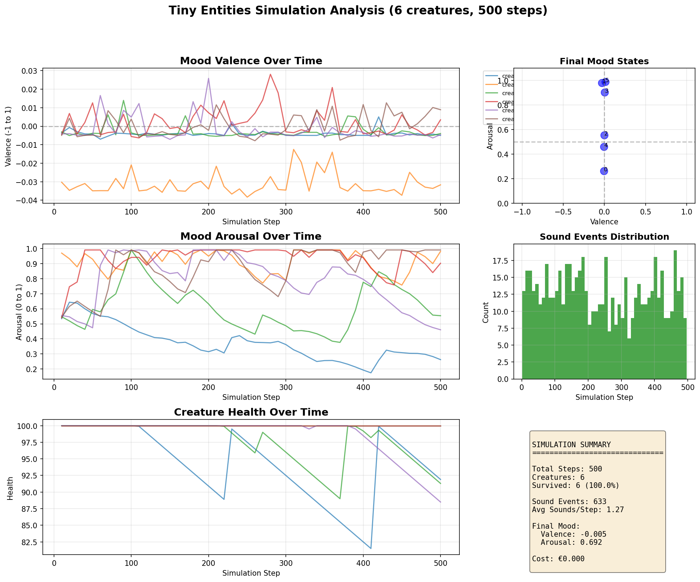
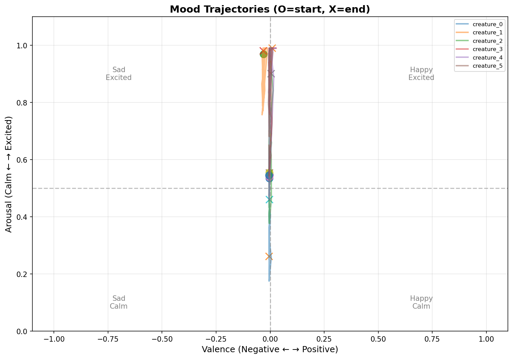

# Visualization Guide

This guide explains how to understand the various visualizations produced by Tiny Entities.

## Real-time Simulation View


### Elements

1. **Grid World** - The dark blue-black background represents empty space
2. **Muted Green Squares** - Food resources that creatures can consume (improved readability)
3. **Light Gray Squares** - Obstacles that block movement
4. **White-Outlined Colored Circles** - Creatures with white borders for high visibility (color indicates mood)
5. **Blue/Red Halos** - Sound waves propagating through space
6. **Info Panel** - Bottom bar shows statistics
7. **Color Legend** - Toggle with L or K key to show/hide the color key explaining all elements

### Creature Colors

Creature color reflects their emotional state with improved brightness for better visibility:

- **Red Channel (Brightness)** - Arousal level (how excited/active)
- **Green vs Blue** - Valence (positive/happy vs negative/sad mood)
- **White Outline** - All creatures have a white border for easy identification

Examples:
- Bright Yellow-Green with White Border = Happy & Excited
- Dim Purple-Blue with White Border = Sad & Calm
- Bright Orange-Red = Aroused but Neutral
- Moderate Yellow-Green = Happy but Calm

### Sound Visualization

- **Blue Halos** - Low-frequency sounds (calm communication)
- **Red Halos** - High-frequency sounds (excited communication)
- **Size** - Amplitude/loudness of the sound
- Sound waves decay over time and propagate to nearby cells

## Analysis Plots



### Mood Valence Over Time
Shows how positive/negative each creature's mood is over the simulation. 
- Above 0 = Positive mood
- Below 0 = Negative mood
- Patterns show stability or volatility of mood

### Mood Arousal Over Time
Shows activity/excitement level (0 = calm, 1 = very excited).
- High arousal = Active, exploring, making sounds
- Low arousal = Resting, conserving energy
- Spikes indicate surprising events

### Creature Health Over Time
Tracks survival and well-being.
- 100 = Perfect health
- 0 = Dead
- Gradual decline = Starvation
- Sharp drop = Death event

### Final Mood States (Scatter Plot)
Shows where creatures ended up in mood space.
- X-axis: Valence (sad to happy)
- Y-axis: Arousal (calm to excited)
- Clustering indicates similar experiences
- Spread indicates diverse personalities

### Sound Events Distribution
Histogram showing when sounds occurred.
- Clusters = Coordinated activity
- Uniform = Random communication
- Patterns can indicate rhythmic behaviors

### Summary Statistics
Key metrics about the simulation run.

## Mood Trajectories



This plot shows the path each creature took through mood space:
- **O markers** = Starting mood state
- **X markers** = Ending mood state
- **Lines** = Path through mood space over time

### Quadrants

The mood space is divided into four emotional regions:

1. **Top Right** - Happy & Excited
   - Finding food, social interaction
   - Making sounds, exploring

2. **Bottom Right** - Happy & Calm
   - Stable food supply
   - Content, conserving energy

3. **Top Left** - Sad & Excited
   - Hungry but actively searching
   - Frustrated, anxious

4. **Bottom Left** - Sad & Calm
   - Resigned, low energy
   - Near death, passive

### Interpreting Trajectories

- **Straight lines** = Stable personality
- **Loops** = Cycling through moods
- **Convergence** = Shared experiences
- **Divergence** = Different adaptations
- **Drift** = Gradual mood change
- **Sharp turns** = Surprising events

## Running Visualizations

### Interactive Mode (with display)

```bash
python examples/basic_simulation.py --visualize --creatures 10
```

Controls:
- **SPACE** - Pause/Resume
- **ESC** - Quit
- **L or K** - Toggle color legend on/off

### Headless Mode (without display)

Generate PNG snapshots:
```bash
python examples/headless_visualization.py --creatures 8 --steps 1000 --output ./my_sim
```

This creates a series of PNG files in the output directory.

### Analysis Mode

Generate comprehensive analysis plots:
```bash
python examples/analysis_with_plots.py --creatures 8 --steps 2000 --output ./analysis
```

Creates:
- `simulation_analysis.png` - Multi-panel overview
- `mood_trajectories.png` - Mood space paths

## What to Look For

### Emergent Patterns

1. **Coordinated Sounds** - Creatures making sounds at similar times
2. **Spatial Clustering** - Creatures gathering together
3. **Mood Synchronization** - Similar emotional trajectories
4. **Rhythmic Behaviors** - Regular patterns in activity
5. **Stable Personalities** - Consistent mood profiles

### Signs of Intelligence

1. **Food Seeking** - Movement toward food sources
2. **Obstacle Avoidance** - Navigation around barriers
3. **Social Response** - Reacting to other creatures' sounds
4. **Learning** - Improving behavior over time
5. **Mood Regulation** - Recovery from negative states

### Interesting Behaviors

- **Positive Feedback Loops** - Sound triggers more sound
- **Emotional Contagion** - Moods spreading between creatures
- **Division of Labor** - Different creatures taking different roles
- **Cultural Drift** - Population-wide behavior shifts
- **Extinction Events** - Mass die-offs and recovery

## Tips for Experiments

1. **Start Small** - 5-8 creatures, 1000 steps to see patterns
2. **Vary Parameters** - Try different creature counts
3. **Look for Surprises** - Unexpected emergent behaviors
4. **Compare Runs** - Random seed creates different outcomes
5. **Document Findings** - Save interesting simulations

## Troubleshooting

### Visualization Too Fast/Slow

Edit `src/simulation/visualization.py`:
```python
self.clock.tick(30)  # Change 30 to desired FPS
```

### Creatures Die Quickly

Increase food density in `src/world/physics.py`:
```python
self._spawn_food(density=0.1)  # Increase from 0.1
```

### Want More Detail

Reduce world size for closer view:
```python
world = SimpleWorld(width=50, height=50)  # Default is 100x100
```

### Analysis Plots Too Cluttered

Reduce creature count or increase sampling interval in the analysis script.

## Advanced Visualization

### Creating Videos

Use ffmpeg to combine snapshots:
```bash
python examples/headless_visualization.py --steps 2000 --output ./frames
cd frames
ffmpeg -framerate 10 -pattern_type glob -i 'snapshot_*.png' -c:v libx264 simulation.mp4
```

### Custom Coloring

The visualization now uses an improved color palette for better readability:
- Food uses a muted green (80, 140, 60) instead of bright green for reduced eye strain
- Creatures have white outlines for immediate visibility
- Background uses a dark blue-black for better contrast
- All colors are defined in a structured palette dictionary in `src/simulation/visualization.py`

You can further customize colors by editing the `self.colors` dictionary in the `SimulationVisualizer.__init__` method.

### Color Legend

Press **L** or **K** during visualization to toggle the color legend on/off. The legend shows:
- All element colors (empty space, food, obstacles, creatures, sounds)
- Example creature moods with their corresponding colors
- The legend appears on the right side of the screen with a semi-transparent background

### Adding Overlays

You can add custom visualizations by modifying the `_draw_info` method or adding new drawing calls in `_draw_world`.

## Next Steps

- See [ROADMAP.md](../ROADMAP.md) for planned visualization improvements
- Check [examples/](../examples/) for more demonstration scripts
- Read the code in [src/simulation/visualization.py](../src/simulation/visualization.py) to understand internals
